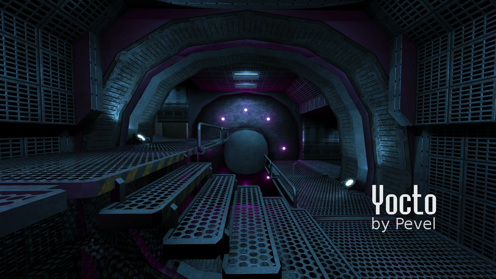

Yocto: underwater habitat
=========================

About
-----

_Yocto_ is a map featuring an abandoned undersea research base.

This map is a work in progress by Paweł “Pevel” Micek for the [Unvanquished](https://unvanquished.net) game project. 

Visit the [Unvanquished website](https://unvanquished.net/) for more information about the game itself.

Legal
-----

Unless otherwise noted, the content of this package is available under the conditions of the [Creative Commons Attribution-Noncommercial-Share Alike 3.0 License](https://creativecommons.org/licenses/by-nc-sa/3.0/).

Some assets may use other licenses, consult [`about/map-yocto.txt`](about/map-yocto.txt) for more information about authors and licenses.